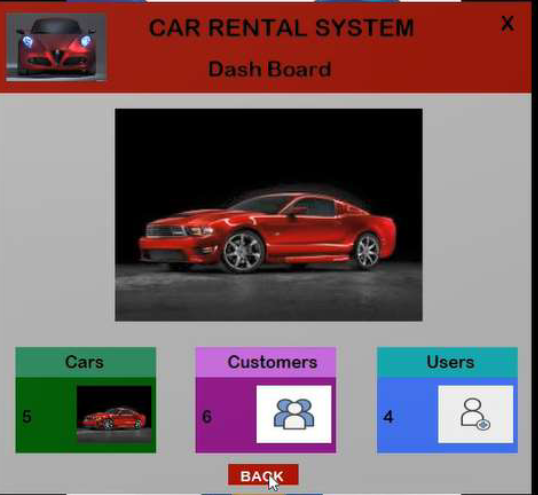
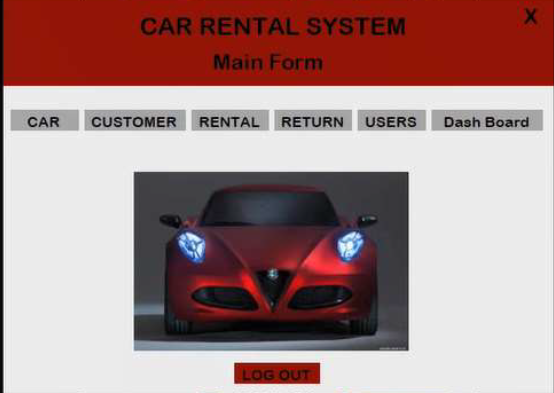
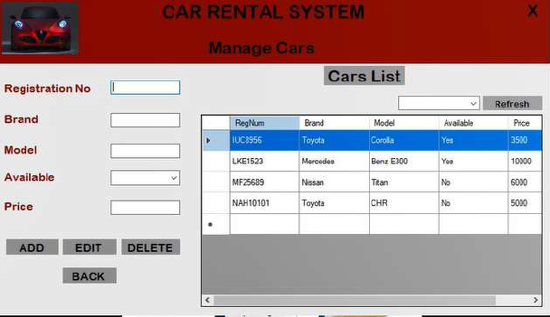
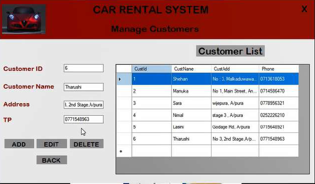

# 🚗 Car Rental Management System

[![Watch Demo][(Screenshots/demo.png)]([[https://www.youtube.com/watch?v=YOUR_VIDEO_ID](https://youtu.be/ru5aC7VbWNQ)](https://github.com/user-attachments/assets/ae74cd95-7407-45ca-9fa4-2e08d78ad7ff))](https://github.com/user-attachments/assets/ae74cd95-7407-45ca-9fa4-2e08d78ad7ff)

A desktop-based **Car Rental Management System** built with **C# Windows Forms** and **SQL Server**, developed as a Level 01 ICT Project for the **Bachelor of Information Technology** degree at the **University of Moratuwa**.

This system was designed to digitize and streamline the manual operations of *NDK Cab Service* — a small-scale car rental business in Sri Lanka — replacing paper-based processes with a fast, reliable, and user-friendly solution.

---

## 📋 Table of Contents

- [Background](#-background)
- [Features](#-features)
- [Screenshots](#-screenshots)
- [Tech Stack](#-tech-stack)
- [System Requirements](#-system-requirements)
- [Database Design](#-database-design)
- [Getting Started](#-getting-started)
- [Project Structure](#-project-structure)
- [Author](#-author)

---

## 🏗 Background

**NDK Cab Service** previously relied on a fully manual system — using paper forms, calculators, and physical records to manage car bookings, customer registrations, and payments. This led to:

- ⏱ Wasted time during peak hours
- 📄 Excessive paperwork and missed customer records
- ❌ No real-time visibility into available vehicles

This system was built to solve these pain points by centralizing all operations into a single, easy-to-use desktop application.

---

## ✨ Features

| Module | Functionality |
|---|---|
| 🔐 **User Login** | Secure authentication with username & password |
| 🚘 **Vehicle Management** | Add, Edit, Delete cars — track availability in real time |
| 👤 **Customer Management** | Register and manage customer profiles |
| 👥 **User Management** | Admin control over system users |
| 📋 **Rental Management** | Issue cars to customers with rental dates |
| 🔄 **Return Management** | Process returns, calculate delays and fines |
| 📊 **Dashboard** | Live count of total Cars, Customers, and Users |
| 🔍 **Search** | Filter cars by availability status |

---

## 📸 Screenshots

| Dashboard | Main Dashboard |
|---|---|
|  |  |

| Manage Cars | Manage Customers |
|---|---|
|  |  |

---

## 🛠 Tech Stack

- **Language:** C# (.NET Framework 4.7)
- **UI Framework:** Windows Forms (WinForms)
- **Database:** Microsoft SQL Server (LocalDB / `.mdf`)
- **IDE:** Visual Studio 2019
- **OS:** Windows 10 (64-bit)

---

## 💻 System Requirements

**Hardware:**
- Processor: Intel Core i3 or higher
- RAM: 2 GB minimum
- Storage: 512 GB HDD

**Software:**
- Windows 10 (64-bit)
- Visual Studio 2019
- .NET Framework 4.7
- SQL Server / LocalDB

---

## 🗄 Database Design

The system uses the following core tables:

```
UserTbl       → Id, Uname, Upass
CarTbl        → RegNum, Brand, Model, Available, Price
CustomerTbl   → CustId, CustName, CustAdd, Phone
RentTbl       → RentId, carReg, CustName, RentDate, ReturnDate, RentFee
ReturnedTbl   → ReturnId, CarReg, CustName, RentDate, Delay, Fine
```

---

## 🚀 Getting Started

### 1. Clone the Repository
```bash
git clone https://github.com/your-username/Car-Rental-Management-System.git
```

### 2. Open in Visual Studio
- Open `Carrental.sln` in **Visual Studio 2019**

### 3. Set Up the Database
- Locate `CarRentaldb.mdf` in the project folder
- Update the connection string in each form if needed:
```csharp
@"Data Source=(LocalDB)\MSSQLLocalDB;
  AttachDbFilename=YOUR_PATH\CarRentaldb.mdf;
  Integrated Security=True;Connect Timeout=30"
```

### 4. Build & Run
- Press `Ctrl + F5` or click **Start** in Visual Studio

### 5. Default Login
```
Username: Yazu
Password: 1234
```

---

## 📁 Project Structure

```
Car-Rental-Management-System/
│
├── Carrental/
│   ├── Splash.cs          # Loading splash screen
│   ├── Login.cs           # User authentication
│   ├── Mainform.cs        # Main navigation hub
│   ├── Car.cs             # Vehicle management
│   ├── Customer.cs        # Customer management
│   ├── Users.cs           # System user management
│   ├── Rental.cs          # Car rental processing
│   ├── Return.cs          # Car return & fine calculation
│   └── DashBoard.cs       # Overview dashboard
│
├── CarRentaldb.mdf        # SQL Server database file
└── README.md
```

---

## 👨‍💻 Author

**K.M.N.D. Kumarasinghe**  
Bachelor of Information Technology
Faculty of Information Technology, University of Moratuwa 🇱🇰

---

## 📄 License

This project was developed for academic purposes as part of **ITE 1942 – ICT Project**.  
Feel free to use it as a reference for learning. ⭐ Star the repo if you found it helpful!
